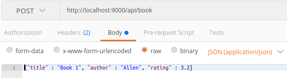

# MongoDB Workshop

This is designed for someone who needs a simple backend API to take HTTP request and interact with MongoDB using [Mongoose](http://mongoosejs.com/)

## How to run

1. Open terminal and `cd` to the directory
2. run `npm install`
3. make sure your `mongod` is up and running or it will crash on startup
4. run `node server.js`
	
If you get something like `failed to connect to server [127.0.0.1:27017] on first connect [MongoError: connect ECONNREFUSED 127.0.0.1:27017]` then good change your MongoDB Daemon is not up and running.

## How to use

If you have an application you just need to point it to the URL of this machine and add the port.

> Example: http://localhost:9000

[Postman](https://www.getpostman.com/) is a tool used to call HTTP Request and see the response. This will be used to test that our server is correctly handling all various HTTP Request.

### Demo

Run these HTTP request to see the API work

**NOTE** you can only run the GET request from your browser since there is no application to send the POST or DELETE request atm. For those you need Postman

- First add some books
	- `POST http://localhost:9000/api/book/  {"title" : "Book 1", "author" : "Allen", "rating" : 3.2}`
	- `POST http://localhost:9000/api/book/  {"title" : "Book 2", "author" : "Bob", "rating" : 2.0}`
	- `POST http://localhost:9000/api/book/  {"title" : "Book 3", "author" : "Carl", "rating" : 4.6}`
	- 
- Search for all authors in database
	 `GET http://localhost:9000/api/book/authors/all`
- Search for books with ratings better then 4.0
	- `GET http://localhost:9000/api/book/rating/4`
- Update the rating of Book 1
    - `POST http://localhost:9000/api/book/  {"id" : < insert book 1 _id here >, "rating" : 4.2}`
- Search for books with ratings better then 4.0 again now
	- `GET http://localhost:9000/api/book/rating/4`
- Delete Carls book
    - `DELETE http://localhost:9000/api/book/<insert book 3 _id here >`


## How it works

Most of this code is the same as the [ExpressJS](../ExpressJS_Workshop) demo, this will only explain the new parts

### Connecting to MongoDB

The first thing to do is connect to MongoDB using Mongoose

```
var mongoose = require('mongoose');                         
var mongoURI = "mongodb://127.0.0.1:27017/DataBaseNameHere";
var mongoDB = mongoose.connect(mongoURI).connection;
mongoDB.on('error', function(err) { console.log(err.message); });
mongoDB.once('open', function() {
  console.log("mongodb connection open");
});
```

What we are doing here is connecting to the database. The **big** thing to note is `var mongoURI = "mongodb://127.0.0.1:27017/DataBaseNameHere";`

If you are running the database on the **same** computer that is running the NodeJS program then you will use `127.0.0.1`. Port `27017` is the default port of MongoDB is only difference if you manually have changed it. `DataBaseNameHere` is the name of the database to access. If the database is empty or not there then Mongoose will create it for you on your first write operation. Also please change to something else, maybe like `Memes` or something cooler.

### Setting up the Routes

The route set up with two line in `server.js`

- `var api = require('./routes/api.js');`
	- This sets `api` as the route
- `app.use.('/api', api)`
	- This tells the server to use `api` anytime someone calls `/api`

So this means if someone calls `localhost:9000/api/` it will get routed to the data in `./routes/api.js`

#### ./routes/api.js

This file can be broken down into 3 parts

```
(function() {
  'use strict';

})();
```

This is how one forces a function to execute in javascrip. This means the information in here is ran when you run `node server.js` instead of having to call the function.

```
var express = require('express');
var router = express.Router();


module.exports = router;
```

This is how we create the route. This is basically saying "When someone `requires()` this file we will give it the object `router`"

So when we called `var api = require('./routes/api.js');` it reall could be looked at as `var api = router;` between the two files


```
router.use('/book', require('./book'));
router.use('/count', require('./count'));
```

This is where the routing happens. This says if anyone calls `/book` to get the route from the folder of `./book`. This means that `localhost:9000/api/book` will be directed to the data in `./routes/book/`

#### ./routes/book/

There are 3 files found in each route

- `index.js`
	- This is where the route checks in the folder
- `model.js`
	- This is where we create the MongoDB Scheme for the Collection
- `controler.js`
	- This is where the logic for the API lives


#### ./routes/book/index.js

So looking into `./routes/book/index.js` we get another route export but we all see a few lines such as

`router.get('/authors/all', controller.getAllAuthors);`

this reads "If someone calls a GET request to `localhost:9000/api/book/authors/all` then run the function `getAllAuthors()` in the controller"

Same idea with

`router.delete('/:id', controller.delete);`

this reads "If someone calls a DELETE request to `localhost:9000/api/book/:id` then run the function `delete()` in the controller and the `:id` passed in the URL can be references as `req.params.id`

#### ./routes/book/book.model.js

Before we see the logic in the controller we need to examine the model first. Lets look at

```
var BookSchema = new Schema(
    {
        title: String,
        author: String,
        rating: Number
    }, { "collection": "book" });
```

This how we create a **Scheme** which is how we force only certain data from be entered or read to the database. This says the collection `book` will have 3 fields per document. a `title` and `author` field of type String and a `rating` field of type Number.

What this does is prevents anyone from entering a rating of `good` because it doesn't fit the schema and will be rejected. This also means if you read an entry from the database you know for sure it will be a number.

#### ./routes/book/book.controller.js

This looks like a very busy file, but its just all the small functions used to fulfill the calls in `index.js`. Lets look at the `router.get('/authors/all', controller.getAllAuthors);` example.

```
var Book = require('./book.model.js');

...

module.exports.getAllAuthors = function(req, res) {
        Book.find({}, {"author" : 1, "_id" : 0}, function (err, result) {
            if (err) {
                console.error(err);
                return res.status(500).send(err);
            }
            return res.json(result);
        });
    };
```

This first runs `Book.find({}` which says it is going to find **everything** in the book collection. From there it will only select the `author` field with our selector `{"author" : 1, "_id" : 0}`.

When the query comes back we run

```
function (err, result) {
    if (err) {
        console.error(err);
        return res.status(500).send(err);
    }
    return res.json(result);
};
```

Which first first checks if there was an error and if so returns a 500 status error saying we couldn't find the data. Note this could be way more detailed and show if the user sent the wrong data to query. For now we are just lumpping all errors into one. If the query was succesful it returns the results with `res.json(result)`. The main thing to note here is that `result` is **always** an array of objects.

## Learn from trying

There are 3 good ways to learn from all of this

1. Try all the calls yourself via Postman
2. Change stuff up a little and see how it effects the code
3. Make a new route and add it to this